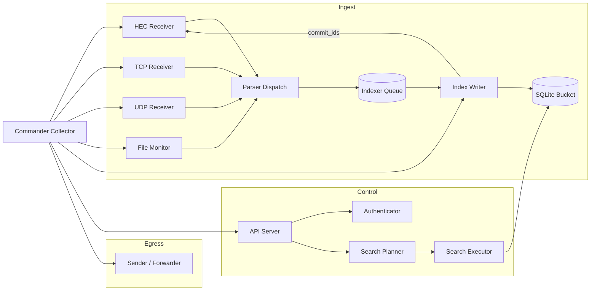
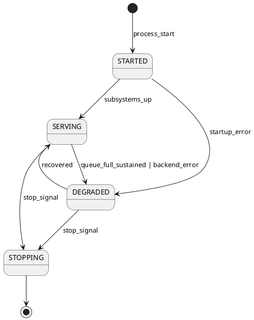
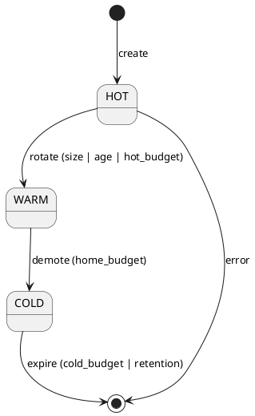

# Sparst — Fresh Implementation Proposal

`Focus: foundation` — defines the design target for the Rust port: what to preserve from spank-py, what to restate, what to replace, the persistence contract, the configuration surface, the SPL tier plan, the composability model, the terminology map, and the phased evolution. The audience is any developer or model session shaping the implementation plan. Does not receive implementation status (that belongs in `Plan.md`) or subsystem details that belong in the Reference docs under `docs/`.

## Scope and Intent

Sparst proposes a new implementation pass for Spank. It absorbs the derivational frame from `Spanker.md`, the language and library comparison from `Pyst.md`, the architectural and operational state from `Architecture.md`, `Infra.md`, `Codebase.md`, `HEC.md`, `Standards.md`, `Splunk.md`, and the positioning from `Product.md`. It names what to keep verbatim, what to restate differently, and what to replace. It is not a rewrite plan in the sense of "throw it out." It is a recomposition plan: preserve the wins, sharpen the contracts, close the Splunk-interop gaps, and give the code and the documents a common spine for verification.

Priorities, stated once and referenced throughout: Splunk alignment (functional decomposition, data flows, persistence, configuration, SPL processing); shipper interoperability; ready mix-and-match of components; consistent user-facing terminology; test and verification tooling that mechanically enforces the standards; branded functionality and performance bundles; artifacts (diagrams, state machines, entity relationships) co-maintained with code through phases that combine specification, documentation, implementation, and verification.

## Contents

1. Wins to Preserve
2. Misses to Overcome
3. Splunk Alignment — Functional Decomposition and Data Flows
4. Persistence and Durability
5. Configuration, Control Plane, SPL
6. Interoperability with Shippers
7. Composability — Components, Interfaces, Mix-and-Match
8. Terminology — User-Facing and Internal
9. Infrastructure and Standards — Enforced by Tooling
10. Product Line — Functionality and Performance Bundles
11. Diagrams and Models — Formats, Sources, Maintenance
12. Phased Evolution — Specification, Documentation, Implementation, Verification
13. Open Questions Deferred

## 1. Wins to Preserve

From `Architecture.md`, `Codebase.md`, `HEC.md`, `Infra.md`, these decisions have paid for themselves and should carry forward without renegotiation:

- Single lifecycle authority. A sole thread-creating coordinator (`SpankCommander` today) owns startup order, shutdown order, and signal handling. Every other thread has one parent.
- Construct-before-start. `__init__` allocates no OS resources; `_open()`/`start()` does. This makes wiring testable without sockets or files.
- Bounded queues always. `maxsize > 0` is mandatory. Memory failure becomes observable drop or backpressure, not OOM.
- `task_done()` in `finally`. `queue.join()` does not deadlock on storage error.
- `_stop_event` set on every exit path; stop-vs-error is always discriminable.
- Daemon threads plus explicit join. The process always exits.
- Composable telemetry helpers held by field, not inheritance (`FlowRegistry[T]`, `AddrStats`, `ArrivalCounters`, `SocketBufferStats`).
- Three-stage HEC decomposition (Receiver, RequestProcessor, submit) with frozen `RequestOutcome` (was `RequestDisposition`; see §8). Clean boundary for unit tests, async swap, FFI.
- Policy/measurement split: the processor measures and reports; the receiver decides.
- Wire-code conformance tests: exact `text` and `code`, not just HTTP status.
- Parser registry as `Callable[[str], dict]`. No class hierarchy; user overrides win.
- Ingestion/interpretation separation: the durable `_raw` is the ground truth; reprocessing is always possible.
- Frozen subsystem configuration dataclasses with four-source precedence, validated in `__post_init__`.
- Zero-runtime-dependency policy. `antlr4-python3-runtime` is the only library on the wire; everything else stdlib.
- Role-specific naming rule (Standards M03–M05, M32): no project branding in infrastructure identifiers; subject-first two-word snake_case for dataclass fields; `time_<noun>` prefix for timestamps.
- Strict layering: `core/` depends on nothing in the product; every subsystem depends only on `core/` plus its declared peers. Cycles broken with `TYPE_CHECKING`.
- Tests without `time.sleep()` as primary sync; dynamic ports with `try/finally`.

These are not up for debate in Spast. The proposal works with them.

## 2. Misses to Overcome

Grouped by where they hurt. Each item cites the source document and the task identifier where available; Spast specifies a corrective posture, not a full design.

### 2.1 HEC as design invariant, not late addition

- ACK protocol missing (HEC R24–R29, §12). Spast: the indexer `commit(ack_ids)` callback hook exists from the first cut, even when ACK is disabled. The hook is wired through the Pipeline; flipping the flag is the only change to turn ACK on.
- Blocking submit on queue full (HEC R30 Defect). Spast: `put_nowait()` is the only admitted enqueue. Full queue returns HEC code 9 (503); receivers never block.
- Health phase states (HEC R18–R20) missing. Spast: `HECPhase` enum `{STARTED, SERVING, DEGRADED, STOPPING}` exists from first cut; `/services/collector/health` reports it.
- Gzip decoding (HEC R21–R23) missing. Spast: gzip is handled in body-decode before parse; parser stays format-free.
- `fields` validation (HEC R12) missing. Spast: per-event validation in `RequestProcessor`; per-event `eventIndex` in error body.
- Exception text leakage in response body (HEC R13, R22). Spast: fixed wire-spec strings only; internals go to the log.
- Channel-required was over-scoped. Spast: channel is required only when ACK is enabled, matching `§13.1` correction.

### 2.2 Input-path throughput and safety

- `FileInput` reads and parses in the same thread (Architecture §2.4, ARCH-Q4 / INP-G3). Spast: a `FileMonitor` thread produces raw lines into a bounded queue; parse workers produce `Record`s. The shape generalizes to TCP/UDP/HEC.
- `HEC` thread-per-connection is unbounded (HEC RL-R3, ISS-2). Spast: `BoundedThreadingHTTPServer` as the stopgap from day one; async event loop is the declared long-term target but is gated on measurement (HEC §7.6).
- `TCP max_line_length` and `HEC max_content_length` not enforced pre-read (Architecture §3.4, §6.3). Spast: enforced at the receiver before body buffering. Chunked bypass closed.
- Regex parsing risks catastrophic backtracking (Architecture §2.4). Spast: sourcetype parsers that are performance-critical migrate to state machines; regex is for long-tail user rules with timeout guards.

### 2.3 Lock and concurrency debt

- HEC `_token_registry` dict has no lock (Architecture §16.5). Spast: `TokenStore` is a small object with explicit `RLock`; rotation is a method, not a mutation.
- `Index._indexes` multi-worker mutation (ENG-D4). Spast: ownership moves to a single indexer-owned structure; workers read through a snapshot API.
- FlowRegistry pre-registration race in `TCPInput._iterate`. Spast: registration happens inside the lock with a compare-and-set idiom.

### 2.4 Control plane, observability, lifecycle

- Auth middleware centralization (Infra C-10) pending. Spast: auth is a single middleware layer applied to every API route by construction; adding a route cannot skip auth.
- `SpankConfig` not frozen (Infra D3). Spast: frozen; regressions fail at construction.
- `str(e)` in response bodies (Infra HEC-C1 open). Spast: banned; helper returns fixed text.
- f-strings at log sites (Infra ENG-S). Spast: `%`-style enforced by linter rule (see §9 below).
- Metrics side channel deferred (Infra §10). Spast: GET `/metrics` (JSON) and `/metrics/prometheus` (text) are built into the control plane from day one; no external process.
- `await_committed()` unsafe with live network inputs (SY-Q3). Spast: it becomes `Drain.wait(tag)`, scoped to a named origin signalled by a `Sentinel`; live streams are unaffected. See §8.4.
- Commander two-collection design works. The structural base name `Collector` (subthread-owning thread) is retained per user direction; behavioral roles continue to be named per subsystem (`Receiver`, `FileMonitor`, etc.). See §8.

### 2.5 Storage

- `bloom_filters` schema present but unpopulated (Architecture §11.2). Spast: either populate at bucket close or remove the schema.
- Count-based tier caps are a regret (Architecture §11.1). Spast: budget-based from the outset (`home_path_max_gb`, `cold_path_max_gb`); counts are defaults, budgets are the policy.
- No FTS5 on `_raw` (ING-ANA4). Spast: FTS5 is opt-in per index; default on for the Strap bundle (see §10).
- Partition search scan limit hardcoded at 10,000 (Product §20.3). Spast: explicit `max_scan_rows` per search; silent truncation is a defect, not a feature.

### 2.6 Product incompleteness against positioning

- No sample dataset, no `--demo` mode, no learner tutorial (Product §6.7). Spast: a built-in `spank demo` subcommand with a bundled small dataset is a launch requirement.
- Forwarder/Relay wiring gap (CLI-FWD1). Spast: Forwarder is wired into the same `Collector` model as inputs; starting a relay is a configuration, not a code change.
- `packaging/` systemd unit not in PyPI dist. Spast: included in the wheel, installed by `spank install-service`.

## 3. Splunk Alignment — Functional Decomposition and Data Flows

Splunk defines the vocabulary users already know. Spank aligns where the alignment is free and diverges only with reason. This section restates the Splunk terms, binds them to Spank components, and fixes the data-flow picture.

### 3.1 Role mapping

| Splunk role | Spank component | Notes |
|---|---|---|
| Universal / Heavy Forwarder | `Forwarder` (output) + `Relay` deployment | No S2S; egress is HEC. |
| Indexer | `Indexer` + `IndexPartition` + `Bucket` | SQLite per bucket. |
| Search Head | `SearchCoordinator` + `SearchCommand` pipeline | Single-process in Strap, splittable in Shank. |
| Deployment Server | (not in scope) | Out of product. |
| License Manager | (not in scope) | Out of product. |
| HEC endpoint | `Receiver` (HEC) | Full `/services/collector/*` surface. |
| REST management | `APIServer` (`/services/...`) | Partial; target Grafana plugin parity. |
| Cluster Master | (not in scope) | Single-node. |

### 3.2 Event model

Spank commits to the Splunk HEC event envelope as the external contract: `event`, `time`, `host`, `source`, `sourcetype`, `index`, `fields`. Internal `Record` fields reuse Splunk names where Splunk uses them: `_time`, `_raw`, and (new) `_indextime`. `_cd` is not modeled; it is Splunk-internal. The `SearchEvent` (REST) and `SearchJob` resources match Splunk field names (`sid`, `dispatchState`, `resultCount`, etc.) as documented in Architecture §23.5.

### 3.3 Bucket lifecycle

Spank adopts Hot, Warm, Cold as externally visible states; Frozen and Thawed are aliases for Cold in the current codebase and Spast does not propose promoting them to first-class states until off-disk retention is in scope. Lifecycle transitions are driven by budget, not count, per §2.5.

### 3.4 Data flow

Two planes, always separate:

- **Ingest plane** (the `Pipeline`). `Receiver` (HEC/TCP/UDP) and `FileMonitor` → `Parser` → `Indexer` queue → `IndexWriter` → `Bucket` (SQLite WAL) → `commit(ack_ids)` → (optional) ACK channel.
- **Control plane**. `APIServer` → `SearchCoordinator` → `Bucket` SELECT (over committed data only) → JSON response. `APIServer` also exposes `/metrics*`, `/health`, `/services/...`.

A separate `egress plane` carries `Sender` output (concrete: `Forwarder`). The ingest Pipeline never waits on egress and vice versa.

### 3.5 SPL

Spank targets the classic SPL subset; SPL2 is explicitly not a target. The parser is ANTLR4 at the filter layer today and expands outward: a small hand-written operator dispatcher reads the filter AST and drives `SearchCommand` objects over streaming `Rows`. SPL → SQL pushdown is opportunistic: the filter AST has a `to_sql(context)` method for SARGable predicates; non-pushable operators consume `Rows` in Python. This keeps the common-case path fast without putting SPL semantics inside the database.

Intermediate representation: `FilterAST` (ANTLR output, normalized), `SearchPipeline = [Step(command, args)]`, `Rows` (alias for `list[Row]` or `Iterable[Row]`). These three types are the stable interface; everything else is a detail. The unqualified `Pipeline` refers to the ingest Pipeline; SPL execution always carries the `Search` qualifier.

## 4. Persistence and Durability

### 4.1 Storage axes

Spast inherits the bucket-per-SQLite-file model. The axes are parameterized:

| Axis | Knob | Default (Strap) | Default (Shank) |
|---|---|---|---|
| Page size | `page_size` | 4096 | 8192 |
| Journal mode | `journal_mode` | `wal` | `wal` |
| Synchronous | `synchronous` | `NORMAL` | `NORMAL` (`FULL` for ACK-critical tenants) |
| FTS5 on `_raw` | `fts5` | `on` | `off` by default, per-index opt-in |
| Max hot buckets | `max_hot_buckets` | 3 | 10 |
| Budget (home) | `home_path_max_gb` | 5 | 100 |
| Budget (cold) | `cold_path_max_gb` | 20 | 1000 |

### 4.2 Durability watermark

`commit(ack_ids)` is invoked after the SQLite write returns (WAL frame written and fsync'd at checkpoint). The durability watermark is monotonic: an ack for id `n` implies all ids `< n` in the same channel are also durable. This is a firm promise.

### 4.3 Ordering

Per-source-identifier order is preserved within a single input instance. Cross-input order is a non-promise; cross-batch order within an indexer is a non-promise. This matches Splunk's semantics and is restated in `Spanker.md` §8.

### 4.4 Specialization for SQLite, DuckDB, Postgres

The storage interface (`BucketWriter`, `BucketReader`, `PartitionManager`) is generic. SQLite is the reference. DuckDB and Postgres are stubs with conformance tests. The tests are the contract; a backend passes or it is not a backend.

## 5. Configuration, Control Plane, SPL

### 5.1 Configuration

Four sources, ascending precedence: compiled defaults, TOML file, CLI argv, `SP_*` environment. Frozen dataclasses. Single `_SP_ENV_TABLE` tuple-list. No hot reload; SIGHUP is graceful restart. The effective config is logged at INFO at startup with `_source` annotations. `--show-config` prints it and exits.

### 5.2 Control plane

`APIServer` hosts:

- `/services/collector/*` (HEC — actually served by `Receiver` but exposed as a unified endpoint) — handled by the HEC subsystem.
- `/services/search/jobs/*` — dispatch, status, results, cancel.
- `/services/data/indexes/*` — list, create (if allowed), stat.
- `/services/authentication/*` — login, logout, users (read), roles (read).
- `/services/server/info` — build, bundle, uptime.
- `/health`, `/metrics`, `/metrics/prometheus`.

Auth middleware is a single decorator applied by the router, not by each handler.

### 5.3 SPL processing

Three layers:

1. **Parse**. `FilterQuery.g4` (ANTLR4) for the filter sub-language; hand-written recursive-descent for the SearchPipeline (`|`-separated commands) — this is cheap and keeps us off a second grammar.
2. **Plan**. SearchPipeline `Step`s are typed; each Step declares `pushable: bool` and `streaming: bool`. The planner chooses the SQL projection and the Python Steps.
3. **Execute**. The executor iterates `Rows` through the Python Steps; the pushed-down filter and projection happen in the SQL query.

## 6. Interoperability with Shippers

Interop is a first-class goal. Spank accepts what shippers emit, and where a shipper has peculiar framing, Spank documents and tests it.

| Shipper | Path | Status | Test |
|---|---|---|---|
| Vector (`splunk_hec`) | HEC JSON, gzip | Gzip required | `test_interop_vector.py` |
| Fluent Bit (`splunk`) | HEC JSON | Tested | `test_interop_fluentbit.py` |
| Filebeat (`output.splunk`) | HEC JSON | Tested | `test_interop_filebeat.py` |
| Logstash (`splunk_hec`) | HEC JSON | Tested | `test_interop_logstash.py` |
| Fluentd (`out_splunk_hec`) | HEC JSON | Spec only | planned |
| rsyslog | RFC 5424 TCP/UDP | Parser Tier 1 | `test_interop_rsyslog.py` |
| OpenTelemetry Collector (`splunk_hec` exporter) | HEC JSON | Sidecar pattern | `test_interop_otelcol.py` |
| curl / scripted | HEC raw or event | Tested | `test_hec_conformance.py` |

Each interop test is a compatibility assertion, not a smoke test. A regression here is a release blocker.

## 7. Composability — Components, Interfaces, Mix-and-Match

Spank is a kit. The components can be assembled into Strap (one process, everything), Shank (server, HEC + API + Indexer), Relay (HEC ingress, Forwarder egress, no storage), or custom mixes.

### 7.1 Interface contracts

The stable interfaces are narrow by design:

- `Input` ABC: `start()`, `stop()`, `get_stats() -> InputStats`. `SocketInput` adds `bind_port`.
- `Parser` type alias: `Callable[[str], dict]`. Registered via `spank.parsers.register(sourcetype, fn)`.
- `SearchCommand` ABC: `execute(rows: Iterable[Row], args: dict) -> Iterable[Row]`.
- `BucketWriter`, `BucketReader`, `PartitionManager`: storage contract (see §4.4).
- `Sender` ABC: `start()`, `stop()`, `submit(rows: Rows)`, `get_stats() -> SenderStats`. Concrete: `Forwarder` (HEC), future `KafkaSender`, `FileSender` (debug).
- `Authenticator` ABC: `authenticate(credentials) -> Principal`, `authorize(principal, resource, action) -> bool`.

Every ABC has:

- A reference implementation.
- A conformance test suite that any implementation must pass.
- A failure-mode table (what the caller should expect on each error class).

### 7.2 Collector and subsystem shape

Every subsystem (Inputs, Indexer, Search, APIServer, Sender) is a `Collector` owning subthreads. The Commander is itself a `Collector`. The pattern is one deep: Commander owns subsystems; each subsystem owns its workers. Nesting beyond two is disallowed without a design note. The `Thread` suffix is dropped from the class name; the `_thread_role` classvar still discriminates ingest/control/egress.

### 7.3 Configuration-driven wiring

Which components run in a given process is determined by `[deployment]` in the TOML file and the `--role` CLI flag. Role presets (`strap`, `shank`, `relay`, `forwarder-only`, `searchhead-only`) compose subsystem configs; they do not enable hidden behavior.

### 7.4 Plugin points

Each plugin point is a small concrete module owning a private dict and exposing `register(name, value)` plus a lookup function. There is no shared "registry" abstraction; the dicts live where they are used and share nothing but Python's mapping protocol.

- Sourcetype parsers — `spank.parsers.register(sourcetype, fn)`. User module loaded from `spank_home/etc/parsers/`.
- SPL commands — `spank.search.commands.register(name, cls)`. Loaded from `spank_home/etc/commands/`.
- Authenticators — selected by name in config; reference is local PBKDF2; LDAP/OIDC are future.
- Senders — selected by name; HEC `Forwarder`, Kafka (future), file (debug).
- Storage backends — selected by name; SQLite is default.

## 8. Terminology — User-Facing and Internal

Terminology has drifted across documents. Spast fixes it in one table and routes every other document to it.

### 8.1 User-facing terms

| Term | Meaning | Notes |
|---|---|---|
| Spank | Product name | In user copy only; never in infra identifiers (Standards M03). |
| Shank | Server deployment | Long-running, HEC + REST + storage. |
| Strap | Embedded/laptop deployment | Single-process, everything included. |
| Relay | HEC in, Forwarder out, no storage | |
| Forwarder | Output component | Not the Splunk UF. |
| Receiver | HEC/TCP/UDP/File ingest component | User-visible in logs. |
| Index | Logical partition of events | Splunk term, preserved. |
| Bucket | One SQLite file of events | Splunk term, preserved. |
| Sourcetype | Parser selector per event | Splunk term, preserved. |
| Source | Event origin (file path, endpoint, etc.) | Splunk term, preserved. |
| Host | Event host field | Splunk term, preserved. |
| Token | HEC auth token | |
| Channel | HEC ack channel | |

### 8.2 Internal terms

| Term | Meaning | Replaces / collides with |
|---|---|---|
| `Collector` | Thread that owns subthreads (structural base) | Was `CollectorThread`; suffix dropped. See Arch §16.8. |
| `Commander` | Sole lifecycle authority | A top-level `Collector`. |
| `Worker` | Banned as a class name | Standards M03/M-naming; use role-specific name. |
| `Receiver` | Network ingress role (HEC/TCP/UDP) | Generalized from HEC. Not used for file ingest. |
| `FileMonitor` | File-ingest reader subthread | Replaces `Tailer`/`FileInput`. |
| `Dispatcher` | HEC accept-loop role | Specific, not "Handler". |
| `Processor` | HEC per-request stage producing `RequestOutcome` | As in HEC `RequestProcessor`. |
| `IndexWriter` | Indexer worker subthread | Existing; keep. |
| `Planner`, `Executor` | SearchPipeline build/run stages | New. |
| `Step` | One SPL operator's worth of work over `Rows` | Replaces `Stage`. |
| `Row` | In-memory event as it travels through a SearchPipeline | Synonym of `Record` at search-execution sites; same object. |
| `Rows` | `list[Row]` / `Iterable[Row]` alias | Replaces `RowBatch`; no class. |
| `Pipeline` | Ingest pipeline (Receiver/Monitor → Parser → Indexer → Bucket) | Unqualified word reserved for ingest. |
| `SearchPipeline` | SPL pipeline: ordered list of `Step` | Splunk-aligned user word. |
| `Sentinel` | End/checkpoint marker enqueued at source termination | New. See §8.4. |
| `Drain` | Wait-side handle keyed on Sentinel `tag` | Replaces `FlushBarrier`. |
| `RequestOutcome` | Result a `Processor` produces from one HEC request | Replaces `RequestDisposition`. |
| `HECPhase` | HEC server lifecycle enum | Replaces `HECReadiness`. Members `STARTED / SERVING / DEGRADED / STOPPING`. |
| `TokenStore` | HEC token holder + lifecycle | Replaces `TokenRegistry` / `_token_registry` dict. |
| `Authenticator` | ABC for credential-to-Principal mapping | Replaces `AuthBackend`. |
| `Principal` | Authenticated identity (see §8.5) | Replaces ad-hoc `user` dicts. |
| `Sender` | Egress ABC | Replaces `OutputSink`. Concrete: `Forwarder`. |
| `Forwarder` | Concrete HEC-egress `Sender` | Existing; keep. |
| `Searcher` | Search-only deployment role | Was `SearchHead`. Splunk's word is "search head"; we run a `Searcher`. |
| `Record` | In-memory event | Existing; keep. Same object as `Row`. |
| `SearchEvent` | REST event resource on `SearchJob` | Was `SpankEvent`. |

### 8.3 Rename list

- `CollectorThread` → `Collector` (drop `Thread` suffix). Behavior inside `TCPInput._iterate` keeps the role label "accept loop" / "watcher"; the `_iterate` name itself is flagged for revisit during the threading-design phase.
- `SpankEvent` (API) → `SearchEvent`. Avoids collision with HEC event.
- `SpankPair` / `Registry` / generic KV — **deleted, not renamed**. The three actual call sites become three concrete narrow modules (`spank.parsers`, `spank.search.commands`, `spank.auth.principals`), each holding a private dict and exposing `register` + lookup. No shared abstraction. (See §7.4.)
- `Tailer` → `FileMonitor`.
- `Stage` → `Step`. `RowBatch` → `Rows` (alias, no class).
- `FlushBarrier` → `Drain` (wait-side); `Sentinel` is the signal-side (new). See §8.4.
- `RequestDisposition` → `RequestOutcome`.
- `HECReadiness` → `HECPhase` with members `STARTED / SERVING / DEGRADED / STOPPING` (UPPER_SNAKE, past-participle steady states paired with active-tense transitional states).
- `TokenRegistry` → `TokenStore`.
- `AuthBackend` → `Authenticator`.
- `OutputSink` → `Sender`. Concrete `Forwarder` keeps its name.
- `SearchHead` (role) → `Searcher`. Bundle: `search-only`.
- `Pipeline` is overloaded: unqualified `Pipeline` means the ingest pipeline; SPL execution is always `SearchPipeline`.
- `_indextime` adopted as Splunk-aligned internal `Record` field.
- `handler` (HEC `_Handler` inner class) stays — it is forced by `BaseHTTPRequestHandler`. Document it.

### 8.4 Sentinel and Drain

A `Sentinel` is a special value enqueued at the end of a source's input stream. The indexing loop, on receipt, stops ingesting from that source's queue stream, flushes its buffers (writes pending `Rows` to the bucket, fsyncs WAL at checkpoint, calls `commit(ack_ids)` on what is durable), and signals the wait-side. The Sentinel itself is end + tag.

```python
@dataclass(frozen=True)
class Sentinel:
    kind: Literal["end", "checkpoint"]   # only "end" is implemented; "checkpoint" reserved
    tag: str                             # source identifier — channel id, file path, run id
```

The wait-side is `Drain`:

```python
class Drain:
    def wait(self, tag: str, timeout: float | None = None) -> bool: ...
    def _signal(self, tag: str) -> None: ...   # called by indexing loop on Sentinel
```

The indexing loop:

```python
for item in queue:
    if isinstance(item, Sentinel):
        flush_buffers(item.tag)
        drain._signal(item.tag)
        continue
    process(item)
```

Use sites: `FileMonitor` enqueues `Sentinel("end", tag=path)` on EOF + close-after-rotate; HEC enqueues `Sentinel("end", tag=channel_id)` on channel close; the test harness enqueues `Sentinel("end", tag=run_id)` after fixture data. `await_committed(tag)` becomes `drain.wait(tag)` and is the SY-Q3 fix from §2.4.

### 8.5 Principal — authoritative definition

A `Principal` is the authenticated party making a request. It is the result of an `Authenticator` accepting a credential. It carries:

- `name: str` — identity string (username, token id, service account).
- `roles: frozenset[str]` — role memberships used by authorization.
- `metadata: Mapping[str, str]` — backend-specific attributes (e.g. token kind, source ip on creation, tenant). Read-only.

It is request-scoped, never persisted, never logged with credential material. Every API route receives the Principal via the auth middleware and passes it to `authorize(principal, resource, action)` before performing the action. There is no global "current principal"; it is a parameter.

## 9. Infrastructure and Standards — Enforced by Tooling

`Standards.md` is authoritative for 33 rules (M01–M33). Today enforcement is mostly manual-review. Spast proposes mechanical enforcement, organized by gate.

### 9.1 Gate 1 — pre-commit (runs on the author's machine)

- `ruff` (lint + format). Custom rules for:
  - No f-string at log call sites (M08).
  - No `ValueError`/`RuntimeError` for domain conditions (M14).
  - No `logger.exception()` (M10).
  - No project brand in infra identifiers (M03).
  - Dataclass field naming (M32) — subject-first two-word check, `time_<noun>` prefix check, `_at` suffix ban.
- `mypy --strict` on `src/spank/`.
- `pytest` on the fast suite (unit tests only, `-m "not slow"`).

### 9.2 Gate 2 — CI on PR

- Full `pytest` suite including conformance, interop, wire-code (HEC R32, ENG-B4).
- Coverage target: 85% line, 75% branch, enforced per-module.
- ANTLR4 grammar check: regenerate and diff; regeneration drift fails the build.
- Config round-trip test: every field in `_SP_ENV_TABLE` has an env var, a CLI flag, a default, and a test.
- Thread-role classvar check: `__init_subclass__` on `_ThreadBase` raises `TypeError` at import if `_thread_role`/`_thread_direction` missing (Standards §6.8 candidate).
- Standards deviations registry (`Infra.md §9.8`): each deviation has an inline `# deviation Mnn` comment; CI checks that every deviation in the registry has a matching comment and every comment has a registry entry.

### 9.3 Gate 3 — release

- Package build for `spank`, `pytest-spank`, `pysigma-backend-spank`.
- Wheel includes systemd unit and logrotate config.
- HEC conformance suite against a reference token set.
- Shipper interop matrix (§6) green.
- `spank demo` smoke test.

### 9.4 Verification tooling

- Unit tests: pytest, per Standards §7.
- Conformance tests: wire-exact, no regex on response bodies.
- Interop tests: real shipper binaries in Docker, driven by a test harness; Docker images versioned and pinned.
- Property tests: `hypothesis` for parser robustness (gated to dev deps only).
- Load tests: `scripts/benchmark.py` with `locust` (dev dep), reporting per Infra §10.6 — `process_ms` p95, drops, queue depth HWM, thread count HWM.
- Fuzz: `atheris` on parsers and the HEC body decoder; scheduled weekly, not per-PR.
- State-machine tests: explicit `states_visited` set per run, asserted against the declared state machine (§11.4).

## 10. Product Line — Functionality and Performance Bundles

Bundles are compositions of the same codebase with different configuration and different certified capacity. Each bundle is branded, has a capacity envelope, and a feature list that is exactly the config surface that is enabled.

### 10.1 Bundles

| Bundle | Tagline | Capacity envelope | Included |
|---|---|---|---|
| **Strap** | Laptop SPL, CI fixture, library | 1 GB/day, 100 rps HEC, 1M events | All inputs, HEC, APIServer, Indexer (SQLite+FTS5), Search, no Forwarder, no TLS required |
| **Shank** | Small-VPS log server | 10 GB/day, 1k rps HEC, 100M events | Strap + Forwarder + TLS required + systemd unit + logrotate |
| **Relay** | HEC ingress, HEC egress | Line rate of HEC | Receiver + Forwarder, no Indexer, no Search |
| **forwarder-only** | Egress agent | 10k eps | File/TCP/UDP inputs + Forwarder; no HEC listen, no Indexer, no API |
| **search-only** (future) | Search over remote buckets | TBD | APIServer + `Searcher` + remote storage adapter; no ingest, no local storage. Splits search capacity from ingest capacity. |

### 10.2 Branding

- Strap, Shank, Relay are the face names. "Bundle" is the project word for a named, configured combination of components; "edition" is not used (it carries a tiered-licensing connotation that Spank rejects per §10.3).
- Taglines from Product §19 are curated by marketing; engineering documents use plain names.

### 10.3 Gating

Bundles differ by config preset, TLS-required flag, and dependency declaration. There is no paid tier, no license check, no phoning home. A user can convert any bundle into any other by changing configuration.

### 10.4 Promotion

Each bundle has:

- A one-page quick-start (`docs/bundles/<name>/quickstart.md`).
- A `docker run` line and a `pip install` + `spank start --role <name>` line.
- A published capacity report (`docs/bundles/<name>/capacity.md`) with the benchmark harness result.
- A certified interop matrix subset.

## 11. Diagrams and Models — Formats, Sources, Maintenance

Artifacts that describe the system should be as testable as the code. Spast standardizes three formats, each for what it does best, and makes them live in the repo as source next to the code they describe.

### 11.1 Formats

| Format | Used for | Source lives in | Renders as |
|---|---|---|---|
| Mermaid | High-level flowcharts, sequence diagrams, component diagrams | `.md` files, in-document | GitHub-native render; `mmdc` for PNG/SVG |
| PlantUML | Detailed class diagrams, state machines | `docs/uml/*.puml` | PNG/SVG via `plantuml.jar` in CI |
| Graphviz (DOT) | Entity relationships, data-flow graphs | `docs/graphs/*.dot` | PNG/SVG via `dot` |

Single-format rules are rigid on purpose: mixing Mermaid and PlantUML for the same diagram class creates drift. High-level is Mermaid; detail is PlantUML; data-flow is DOT.

### 11.2 Diagrams to author now

- **Component diagram (Mermaid)** — Commander, Inputs, Indexer, Search, APIServer, Forwarder, Auth, Registry. Shows which depends on which. Authored in §11.5 below.
- **Ingest sequence diagram (Mermaid)** — HEC client → Receiver → Processor → Indexer queue → IndexWriter → Bucket → `commit(ack_ids)` → ACK response.
- **State machine, HEC server phase (PlantUML)** — `STARTED → SERVING ↔ DEGRADED → STOPPING` (`HECPhase`).
- **State machine, bucket lifecycle (PlantUML)** — `HOT → WARM → COLD` with transition conditions (size, age, budget).
- **State machine, search job (PlantUML)** — `QUEUED → RUNNING → FINALIZING → DONE | FAILED | CANCELLED`.
- **Entity relationship (DOT)** — `Index` 1..N `Bucket`, `Bucket` 1..N `Record`, `Token` 1..N `Channel`, `Channel` 1..N `Ack`, etc.
- **Thread inventory (Mermaid component)** — every long-lived thread with its owner and its stop mechanism.

### 11.3 Maintenance policy

- Every diagram has a comment header naming the responsible module(s). A PR that changes those modules touches the diagram.
- CI renders all diagrams to `build/diagrams/` and fails if rendering fails.
- CI does not enforce diagram-code correspondence automatically; that remains review.
- Diagrams live in the same branch as the code they describe; no separate diagram repo.

### 11.4 State-machine testability

State machines declared in PlantUML are also declared as Python `enum.Enum` + allowed-transition set in code. Tests can assert `assert_transition(old, new)` at every transition site. CI has a check: every state in the `.puml` file has a matching enum member, and every transition has a matching allowed pair.

### 11.5 Seed: component diagram

A seed component diagram to start from, embedded here for review. It will move to `docs/diagrams/components.mmd` when we commit.



### 11.6 Seed: HEC phase state machine



### 11.7 Seed: bucket lifecycle



## 12. Phased Evolution — Specification, Documentation, Implementation, Verification

Each phase produces all four artifact classes. A phase is done when the four are consistent: the spec names what, the document narrates why, the code implements it, the tests prove it.

### Phase 0 — Spine

Goal: establish the contracts, the diagrams, the tooling gates.

- Freeze the ABCs in §7.1 as reference code. Every ABC has a conformance test file.
- Freeze the terminology in §8. Open rename PRs for `CollectorThread → Collector`, `SpankEvent → SearchEvent`, deletion of the KV abstraction (`SpankPair`/`Registry`) in favor of three concrete narrow modules, plus the §8.3 list (`Tailer → FileMonitor`, `Stage → Step`, `RowBatch → Rows`, `FlushBarrier → Drain` + new `Sentinel`, `RequestDisposition → RequestOutcome`, `HECReadiness → HECPhase`, `TokenRegistry → TokenStore`, `AuthBackend → Authenticator`, `OutputSink → Sender`, `SearchHead → Searcher`).
- Author the seed diagrams from §11 into `docs/diagrams/`.
- Wire `ruff` custom rules, `mypy --strict`, CI thread-role check, state-machine-enum check.
- Write the `Standards.md` deviations comment-check script.

Exit criterion: CI is red on every current violation of the standards. The list of reds is the backlog.

### Phase 1 — HEC as invariant

Goal: close the HEC-miss list (§2.1).

- `HECPhase` enum and state machine.
- `ACKTracker` with `commit(ack_ids)` callback wired through indexer even when ACK is disabled.
- `put_nowait()` with 503/code-9 on queue full.
- Gzip decode in body stage.
- `fields` validation per-event.
- `BoundedThreadingHTTPServer` with connection ceiling.
- Interop tests (§6) against Vector, Fluent Bit, Filebeat, Logstash, OTel Collector sidecar.

Exit criterion: HEC conformance suite green. Interop matrix green. Slowloris attack from §HEC §7.6.3 fails to DoS.

### Phase 2 — Pipeline decoupling

Goal: close input-path throughput (§2.2) and lock debt (§2.3).

- File reader/parser split (`FileMonitor` → raw-line queue → parse workers → Record queue).
- TCP/UDP read/parse split on the same pattern.
- `TokenStore` with `RLock` and rotation API.
- `Index._indexes` ownership to single indexer-owned structure.
- `Sentinel` + `Drain` introduced; `await_committed(tag)` becomes `drain.wait(tag)`.

Exit criterion: `scripts/benchmark.py` shows at least 10x over current `FileInput` throughput at same CPU. Lock audit passes.

### Phase 3 — SPL and storage

Goal: complete SPL surface and close storage regrets (§2.5).

- Pipeline parser (hand-written) + filter AST (ANTLR4); `Planner`/`Executor` split.
- SPL commands that are missing (`transaction`, `join`, `append`, subsearch) added with conformance tests.
- Budget-based bucket lifecycle.
- FTS5 opt-in per index; default on for Strap.
- `max_scan_rows` explicit; silent truncation removed.

Exit criterion: 25 + 4 = 29 commands pass Splunk-equivalence tests. Storage conformance tests pass on SQLite and DuckDB.

### Phase 4 — Product completion

Goal: ship the learner and the small-deployer.

- `spank demo` with bundled dataset.
- Forwarder/Relay wired through CLI.
- TLS cert tooling (`spank cert ...`).
- systemd unit in wheel; `spank install-service`.
- Capacity reports for Strap and Shank published.

Exit criterion: a new user on a laptop runs `pip install spank && spank demo && spank start` and has an answer to "what does this do" in 60 seconds. An operator on a VPS runs `spank install-service` and has a running Shank in 5 minutes.

### Phase 5 — Beyond the spine

Deferred explicitly: async I/O model for HEC (gated on Phase 1 measurements), DuckDB/Postgres backends (conformance tests stay green), remote storage for the `search-only` bundle, LDAP/OIDC `Authenticator` backends, OTLP-native input (no, per Infra).

## 13. Open Questions Deferred

Spast does not resolve these and flags them for a follow-up session. Each is material to the new implementation but none block Phase 0 or Phase 1.

- Async event loop for HEC (HEC §7.6): does the connection profile justify it before Phase 4?
- S2S ingress (Splunk §2.1): stays out of scope; revisit only if a concrete buyer requires it.
- OTLP-native: stays out of scope; revisit if the OTel sidecar turns out to be unpalatable.
- Off-node bucket storage (`search-only` bundle prerequisite): design note needed.
- Management UI (static web vs Textual TUI): deferred to Phase 5.
- Per-token RPS enforcement vs global rate limit (HEC RL-R5): scope and default posture.
- Timestamp handling for non-UTC sources: a full table of conversion rules is owed.

---

This document is a proposal. It does not by itself change the code or the other documents. It is the planned shape of the combination of what exists and what comes next; the Phase 0 exit criterion is the moment the combination becomes enforceable.
